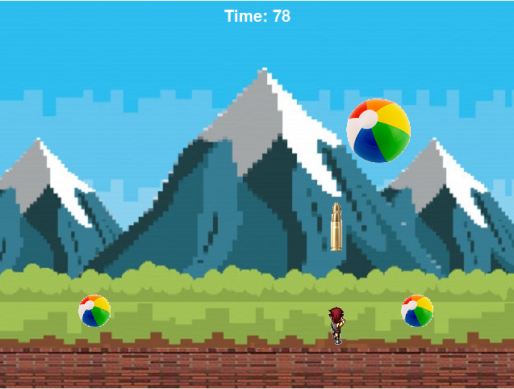

# Pygame Projects
1. Tom and Jerry

  - As we see in the Tom and Jerry cartoon, Tom tries to catch Jerry in the game. Tom is falling from sky randomly to catch Jerry.
  - Jerry can only move to left and right to run away from Tom.
  - The score will be added every .5s and is displayed on the top of screen.
  - If Tom catches Jerry, the game is over and your final score will show up.
  
2. Ball Destroy

  - Player has 100 seconds to destroy all balls with bullet
  - If a bullet hit the ball, it is divided into two small-sized balls
  - Player must remove all balls to win the game
  - Game is over when,
      - Ball hit the player
      - Player fails to destroy all balls in 100 seconds
      - Player completely destroys all balls in 100 seconds
